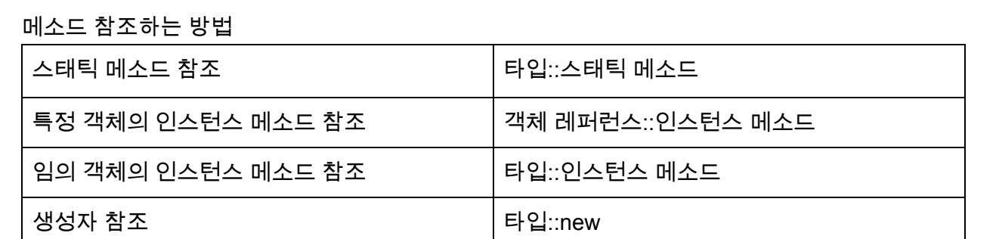

# Java 함수형 프로그래밍

## 목차
1. [함수형 인터페이스 (Functional Interface)](#함수형-인터페이스-functional-interface)
2. [람다 표현식 (Lambda Expressions)](#람다-표현식-lambda-expressions)
3. [변수 캡처 (Variable Capture)](#변수-캡처-variable-capture)
4. [메소드 레퍼런스 (Method References)](#메소드-레퍼런스-method-references)
5. [인터페이스의 변화 (Changes in Interfaces)](#인터페이스의-변화-changes-in-interfaces)
6. [자바 8 API의 기본 메소드와 스태틱 메소드](#자바-8-api의-기본-메소드와-스태틱-메소드)
7. [Stream 소개 (Introduction to Streams)](#stream-소개-introduction-to-streams)
8. [Stream API](#stream-api)
9. [Optional 소개 (Introduction to Optional)](#optional-소개-introduction-to-optional)
10. [Optional API](#optional-api)
11. [Date와 Time API 소개 (Introduction to Date and Time API)](#date와-time-api-소개-introduction-to-date-and-time-api)
12. [Date와 Time API 사용법 (Using the Date and Time API)](#date와-time-api-사용법-using-the-date-and-time-api)

## 함수형 인터페이스 (Functional Interface)

- **함수형 인터페이스**: 추상 메소드를 딱 하나만 가지고 있는 인터페이스.
- **SAM (Single Abstract Method) 인터페이스**: 단일 추상 메소드만을 가진 인터페이스.
- **@FunctionalInterface 애노테이션**: 함수형 인터페이스임을 명시.
- **static, default 메소드**: 함수형 인터페이스 내에 공존할 수 있음.
- **람다함수**: 함수형 인터페이스를 구현할 수 있음.

### 주요 함수형 인터페이스

- **Function<T, R>**: T 타입을 받아서 R 타입을 리턴하는 함수 인터페이스.
- **BiFunction<T, U, R>**: T, U 타입을 받아서 R 타입을 리턴하는 함수 인터페이스.
- **Consumer<T>**: T 타입을 받고, 리턴 없음.
- **Supplier<T>**: 인풋 없이 T 타입을 리턴.
- **Predicate<T>**: T 타입을 받아서 boolean을 리턴.
- **UnaryOperator<T>**: Function<T, T>와 동일.
- **BinaryOperator<T>**: BiFunction<T, T, T>와 동일.

## 람다 표현식 (Lambda Expressions)

- **기본 형식**: `(인자 리스트) -> {바디}`

## 변수 캡처 (Variable Capture)

- **캡처된 변수**: 람다 표현식이나 익명 내부 클래스에서 외부의 지역 변수를 사용할 때, 해당 변수는 "캡처된 변수"가 됨.
- **불변성 (effective final)**: 캡처된 변수는 암묵적으로 `final`로 간주되어, 람다 또는 익명 클래스 내부에서 값을 변경할 수 없음.
- **유효 범위**: 캡처된 변수는 람다 또는 익명 클래스의 생명주기 동안 접근 가능하지만, 해당 변수의 유효 범위는 원래의 유효 범위를 벗어나지 않음.

## 메소드 레퍼런스 (Method References)

- **기본 개념**: 람다가 기존 메소드 또는 생성자를 호출하는 거라면, 메소드 레퍼런스를 사용해서 표현 가능.




## 인터페이스의 변화 (Changes in Interfaces)

### 인터페이스 기본 메소드와 스태틱 메소드

#### 기본 메소드 (Default Methods)

- **기본 메소드**: 인터페이스에 메소드 선언이 아니라 구현체를 제공하는 방법.
- **새 기능 추가**: 해당 인터페이스를 구현한 클래스를 깨트리지 않고 새 기능을 추가할 수 있음.
- **리스크**: 기본 메소드는 구현체가 모르게 추가된 기능으로 그만큼 리스크가 있음.
  - **런타임 에러**: 컴파일 에러는 아니지만 구현체에 따라 런타임 에러가 발생할 수 있음.
  - **문서화**: 반드시 문서화 할 것. (`@implSpec` 자바독 태그 사용).
- **Object 메소드 제외**: Object가 제공하는 기능 (`equals`, `hashCode`)는 기본 메소드로 제공할 수 없음. 구현체가 재정의해야 함.
- **제한 사항**: 본인이 수정할 수 있는 인터페이스에만 기본 메소드를 제공할 수 있음.
- **추상 메소드로 변경**: 인터페이스를 상속받는 인터페이스에서 다시 추상 메소드로 변경할 수 있음.
- **재정의 가능**: 인터페이스 구현체가 재정의 할 수도 있음.

#### 스태틱 메소드 (Static Methods)

- **유틸리티 메소드**: 해당 타입 관련 헬퍼 또는 유틸리티 메소드를 제공할 때 인터페이스에 스태틱 메소드를 제공할 수 있음.

## 자바 8 API의 기본 메소드와 스태틱 메소드

### Iterable의 기본 메소드

- `forEach()`
- `spliterator()`

### Collection의 기본 메소드

- `stream() / parallelStream()`
- `removeIf(Predicate)`
- `spliterator()`

### Comparator의 기본 메소드 및 스태틱 메소드

- `reversed()`
- `thenComparing()`
- `static reverseOrder() / naturalOrder()`
- `static nullsFirst() / nullsLast()`
- `static comparing()`

## Stream 소개 (Introduction to Streams)

- **Stream**: sequence of elements supporting sequential and parallel aggregate operations.
- **데이터 저장소 아님**: 데이터를 담고 있는 저장소 (컬렉션)이 아님.
- **함수형**: 스트림이 처리하는 데이터 소스를 변경하지 않음.
- **단일 처리**: 스트림으로 처리하는 데이터는 오직 한 번만 처리함.
- **무제한 가능**: 무제한일 수도 있음 (Short Circuit 메소드를 사용해서 제한 가능).
- **지연 평가**: 중개 오퍼레이션은 근본적으로 lazy 함.
- **병렬 처리**: 손쉽게 병렬 처리할 수 있음.

### 스트림 파이프라인

- **구성**: 0 또는 다수의 중개 오퍼레이션 (intermediate operation)과 한개의 종료 오퍼레이션 (terminal operation)으로 구성.
- **처리 시점**: 스트림의 데이터 소스는 오직 터미널 오퍼레이션을 실행할 때에만 처리함.

### 중개 오퍼레이션

- **Stream을 리턴**: Stream을 리턴함.
- **Stateless / Stateful**: Stateless / Stateful 오퍼레이션으로 더 상세하게 구분 가능. (대부분은 Stateless지만 distinct나 sorted처럼 이전 소스 데이터를 참조해야 하는 오퍼레이션은 Stateful 오퍼레이션임).
- **예시**: `filter`, `map`, `limit`, `skip`, `sorted`, ...

### 종료 오퍼레이션

- **Stream을 리턴하지 않음**: Stream을 리턴하지 않음.
- **예시**: `collect`, `allMatch`, `count`, `forEach`, `min`, `max`, ...

## Stream API

### 걸러내기

- **Filter(Predicate)**: 데이터를 조건에 따라 필터링함.
  - **예시**: 이름이 3글자 이상인 데이터만 새로운 스트림으로.

### 변경하기

- **Map(Function) 또는 FlatMap(Function)**: 데이터를 다른 형태로 변환함.
  - **예시**: 각각의 Post 인스턴스에서 String title만 새로운 스트림으로.
  - **예시**: `List<Stream<String>>`을 `String`의 스트림으로.

### 생성하기

- **generate(Supplier) 또는 Iterate(T seed, UnaryOperator)**: 무제한 스트림 생성.
  - **예시**: 10부터 1씩 증가하는 무제한 숫자 스트림.
  - **예시**: 랜덤 int 무제한 스트림.

### 제한하기

- **limit(long) 또는 skip(long)**: 스트림의 크기를 제한함.
  - **예시**: 최대 5개의 요소가 담긴 스트림을 리턴함.
  - **예시**: 앞에서 3개를 뺀 나머지 스트림을 리턴함.

### 특정 조건 확인

- **anyMatch(), allMatch(), nonMatch()**: 스트림의 데이터가 특정 조건을 만족하는지 확인.
  - **예시**: `k`로 시작하는 문자열이 있는지 확인 (true 또는 false 리턴).
  - **예시**: 스트림의 모든 값이 10보다 작은지 확인.

### 개수 세기

- **count()**: 스트림의 요소 개수를 셈.
  - **예시**: 10보다 큰 수의 개수를 셈.

### 데이터 뭉치기

- **reduce(identity, BiFunction), collect(),

sum(), max()**: 스트림의 데이터를 하나로 뭉침.
- **예시**: 모든 숫자의 합 구하기.
- **예시**: 모든 데이터를 하나의 `List` 또는 `Set`에 옮겨 담기.

## Optional 소개 (Introduction to Optional)

- **NullPointerException 방지**: 자바 프로그래밍에서 NullPointerException을 방지하기 위함.
  - **원인**: null을 리턴하고 null 체크를 깜빡함.
- **특별한 상황 처리**: 메소드에서 작업 중 특별한 상황에서 값을 제대로 리턴할 수 없는 경우 선택할 수 있는 방법.
  - **예외를 던짐**: 비용이 비쌈 (스택트레이스를 찍어두니까).
  - **null을 리턴**: 비용 문제는 없지만, 그 코드를 사용하는 클라이언트 코드가 주의해야 함.
  - **Optional 리턴**: 클라이언트 코드에게 명시적으로 빈 값일 수도 있다는 것을 알려주고, 빈 값인 경우에 대한 처리를 강제함.

### Optional

- **컨테이너**: 오직 값 한 개가 들어있을 수도 없을 수도 있는 컨테이너.

#### 주의할 점

- **리턴값으로만 사용**: 메소드 매개변수 타입, 맵의 키 타입, 인스턴스 필드 타입으로 사용하지 말 것.
- **null 리턴 금지**: Optional을 리턴하는 메소드에서 null을 리턴하지 말 것.
- **프리미티브 타입용 Optional**: OptionalInt, OptionalLong, ...
- **Collection, Map, Stream, Array, Optional**: Optional로 감싸지 말 것.

## Optional API

### Optional 만들기

- `Optional.of()`
- `Optional.ofNullable()`
- `Optional.empty()`

### Optional에 값이 있는지 없는지 확인하기

- `isPresent()`
- `isEmpty()` (Java 11부터 제공)

### Optional에 있는 값 가져오기

- `get()`
  - **주의**: 비어있는 Optional에서 값을 꺼내면 예외 발생.

### Optional에 값이 있는 경우에 그 값을 가지고 ~~를 하라.

- `ifPresent(Consumer)`
  - **예시**: "Spring"으로 시작하는 수업이 있으면 id를 출력하라.

### Optional에 값이 있으면 가져오고 없는 경우에 ~~를 리턴하라.

- `orElse(T)`
  - **예시**: "JPA"로 시작하는 수업이 없다면 비어있는 수업을 리턴하라.

### Optional에 값이 있으면 가져오고 없는 경우에 ~~를 하라.

- `orElseGet(Supplier)`
  - **예시**: "JPA"로 시작하는 수업이 없다면 새로 만들어서 리턴하라.

### Optional에 값이 없으면 에러를 던져라.

- `orElseThrow()`

### Optional에 들어있는 값 걸러내기

- `Optional.filter(Predicate)`

### Optional에 들어있는 값 변환하기

- `Optional.map(Function)`
- `Optional.flatMap(Function)`: Optional 안에 들어있는 인스턴스가 Optional인 경우에 사용하면 편리함.

## Date와 Time API 소개 (Introduction to Date and Time API)

### 자바 8에 새로운 날짜와 시간 API가 생긴 이유

- **문제점**:
  - 기존 `java.util.Date` 클래스는 mutable하기 때문에 thread-safe하지 않음.
  - 클래스 이름이 명확하지 않음. Date인데 시간까지 다룸.
  - 버그 발생 여지 많음 (타입 안정성이 없고, 월이 0부터 시작).
  - 복잡한 날짜 시간 처리는 보통 Joda Time 사용.

### 자바 8에서 제공하는 Date-Time API

- **JSR-310**: 스펙의 구현체 제공.
- **디자인 철학**:
  - **Clear**
  - **Fluent**
  - **Immutable**
  - **Extensible**

### 주요 API

- **기계용 시간 (machine time)과 인류용 시간 (human time)**
  - **기계용 시간**: EPOCH (1970년 1월 1일 0시 0분 0초)부터 현재까지의 타임스탬프.
  - **인류용 시간**: 연, 월, 일, 시, 분, 초 등을 표현.
  - **타임스탬프**: `Instant` 사용.
  - **특정 날짜**: `LocalDate`, 시간(`LocalTime`), 일시(`LocalDateTime`).
  - **기간**: 시간 기반(`Duration`), 날짜 기반(`Period`).
  - **포매팅**: `DateTimeFormatter` 사용.


## Date와 Time API 사용법 (Using the Date and Time API)

### 기계 시간을 표현하는 방법

- **Instant.now()**: 현재 UTC (GMT)를 리턴.
  ```java
  Instant now = Instant.now();
  System.out.println(now);
  System.out.println(now.atZone(ZoneId.of("UTC")));
  ZonedDateTime zonedDateTime = now.atZone(ZoneId.systemDefault());
  System.out.println(zonedDateTime);
  ```

### 인류용 일시를 표현하는 방법

- **LocalDateTime.now()**: 현재 시스템 Zone에 해당하는(로컬) 일시를 리턴.
- **LocalDateTime.of(int, Month, int, int, int, int)**: 로컬의 특정 일시를 리턴.
- **ZonedDateTime.of(int, Month, int, int, int, int, ZoneId)**: 특정 Zone의 특정 일시를 리턴.

### 기간을 표현하는 방법

- **Period / Duration .between()**:
  ```java
  Period between = Period.between(today, birthDay);
  System.out.println(between.get(ChronoUnit.DAYS));
  ```

### 파싱 또는 포매팅

- **포맷 참고**: [DateTimeFormatter의 미리 정의된 포맷](https://docs.oracle.com/javase/8/docs/api/java/time/format/DateTimeFormatter.html#predefined)
- **LocalDateTime.parse(String, DateTimeFormatter)**:
  ```java
  DateTimeFormatter formatter = DateTimeFormatter.ofPattern("MM/d/yyyy");
  LocalDate date = LocalDate.parse("07/15/1982", formatter);
  System.out.println(date);
  System.out.println(today.format(formatter));
  ```

### 레거시 API 지원

- **GregorianCalendar와 Date 타입의 인스턴스를 Instant나 ZonedDateTime으로 변환 가능**:
  ```java
  ZoneId newZoneAPI = TimeZone.getTimeZone("PST").toZoneId();
  TimeZone legacyZoneAPI = TimeZone.getTimeZone(newZoneAPI);
  Instant newInstant = new Date().toInstant();
  Date legacyInstant = Date.from(newInstant);
  ```
